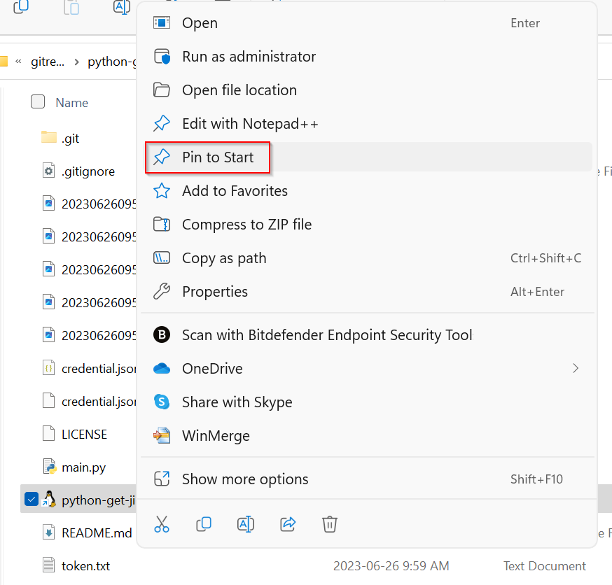

# python-get-jira-hours
This python 3 script authenticate to Jira using API token, then retrieve and aggregate hours worked per day based on project ID.

# Prerequisites
- Python3
- Jira library:
    
    ```sudo pip install jira```
- credential.json
    
    Copy credential.json.sample to credential.json and modify the content to match your environment

    When ENABLE_HYPERLINK set to true, issue will be print out as clickable hyperlink in supported console for quick access to issue. If this is an issue, make sure ENABLE_HYPERLINK is set to false in credential.json

# To generate Jira API token

- Logon to Jira
- On top right side, click on your profile picture, then choose "Manage account"

    

- Security tab -> Create and manage API tokens

    

- Create API token

    

- Give API token a label, eg: python-get-jira-hours

    

- Copy and save your API token

    


# To run the script
- Make sure credential.json is populated with correct information, see credential.json.sample
- Run
    ```
    python3 main.py
    ```


# Trick to run in Windows + WSL2
- Create a shortcut target, modify the path to make sure it point to the location of the main.py 
    ```
    C:\Windows\System32\wsl.exe python3 /mnt/c/gitrepos/python-get-jira-hours/main.py
    ```
- Right click and choose Pin to start

    
- Now it's in start menu for quick access

    